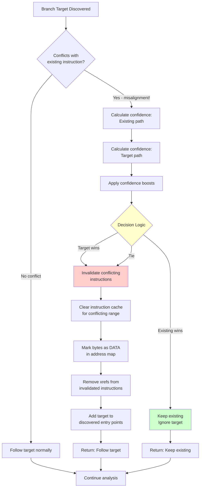
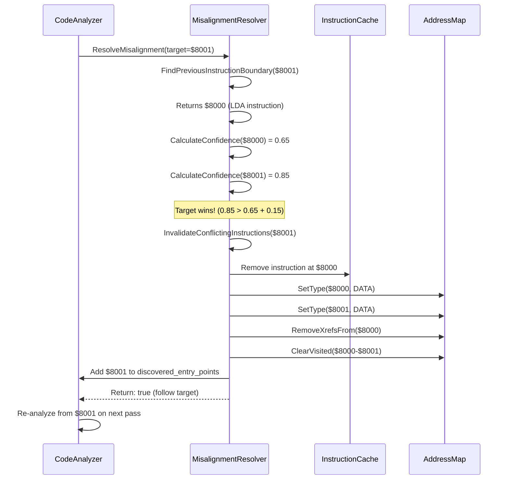
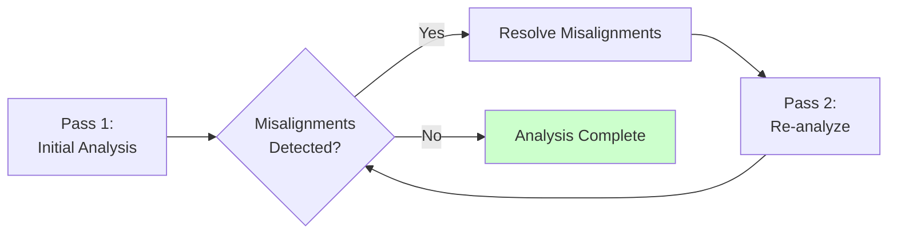

# Misalignment Resolution Algorithm

## Problem Statement

During recursive disassembly analysis, we may discover a branch target that conflicts with an existing instruction boundary:

```
Existing:  $8000: LDA #$12    (2 bytes: $8000-$8001)
           $8002: STA $1000   (3 bytes: $8002-$8004)

Branch:    BEQ $8001          (targets middle of LDA instruction!)
```

We must choose: is the existing disassembly correct, or should we re-analyze from the branch target?

**Why This Happens:**
- **Self-modifying code**: Code that changes at runtime
- **Obfuscation**: Anti-disassembly techniques
- **Analysis errors**: Wrong entry point or incorrect prior disassembly
- **Overlapping code**: Legitimate technique where instructions intentionally overlap

**Consequences of Wrong Choice:**
- **False Positive** (follow bad target): Corrupt valid code with wrong disassembly
- **False Negative** (ignore valid target): Miss legitimate code paths

## Algorithm Overview



## Confidence Scoring

Each interpretation receives a score (0.0 - 1.5) based on multiple factors:

### Scoring Factors

| Factor | Points | Description |
|--------|--------|-------------|
| **Valid Sequence** | +0.08 per instruction (max 5) | Can disassemble consecutive valid instructions |
| **Common Instructions** | +0.08 each | LDA, STA, ADD, SUB, etc. (typical code) |
| **Stack Operations** | +0.10 to +0.20 | PSHS/PULS (+0.20 at position 0 = subroutine start) |
| **Branches/Calls** | +0.05 each | BEQ, JSR, etc. (control flow) |
| **Rare Instructions** | -0.10 to -0.30 | SWI, SYNC, CWAI (suspicious if frequent) |
| **Cross-References** | +0.25 | Other code branches to this address |
| **Short Sequence** | -0.15 | Fewer than 3 valid instructions |
| **Pattern: Multiple Rare** | -0.20 | 2+ rare instructions in sequence |
| **Pattern: Multiple Common** | +0.15 | 3+ common instructions in sequence |

### Instruction Frequency Analysis

Based on statistical analysis of real 6809 binaries (ZAXXON.BIN, Apple II games, etc.):

```
Instruction Type             Frequency    Interpretation
────────────────────────────────────────────────────────
Load/Store/Transfer          30-40%       Most common - strong code signal
Arithmetic/Logic             20-30%       Very common - good code signal
Stack Operations            10-15%       Common at function boundaries
Branches/Calls              10-15%       Control flow
Software Interrupts         <1%          Rare - suspicious if frequent
```

**Data vs Code Signatures:**
- **Real Code**: Dominated by load/store/arithmetic, few rare instructions
- **Random Data**: Random mix with many suspicious patterns (SWI, invalid sequences)

### Decision Logic

```cpp
// Calculate confidence for both interpretations
float target_confidence = CalculateInstructionConfidence(target_address);
float existing_confidence = CalculateInstructionConfidence(existing_address);

// Apply boosts
if (is_unconditional_branch) {
    target_confidence += 0.2f;  // JMP/JSR more authoritative
}

if (target_starts_with_PULS) {
    target_confidence += 0.4f;  // Strong signal: error path cleanup
}

// Decision thresholds (see ADR-0001 for rationale)
const float kConfidenceThreshold = 0.15f;  // Minimum difference to override
const float kTieMargin = 0.05f;            // Margin for tie-breaking

bool is_tied = (abs(target_confidence - existing_confidence) <= kTieMargin);

if (target_confidence > existing_confidence + kConfidenceThreshold || is_tied) {
    // Target wins - invalidate existing and follow target
    return true;
} else {
    // Existing wins - keep existing interpretation
    return false;
}
```

**Tie-Breaking Rule:** When scores are equal (within tie margin), favor the branch target. Rationale: Cross-references are strong evidence of valid entry points.

## Confidence Boosts

### Unconditional Branch Boost (+0.2)

```
Branch Type          Authority Level
───────────────────────────────────
JMP/JSR/BRA/LBRA    HIGH (+0.2)     Always taken
BEQ/BNE/etc         NORMAL (0.0)    Conditionally taken
```

**Rationale:** Unconditional branches are more authoritative. Compiler/programmer explicitly directs control flow here, so target is very likely correct.

### PULS/PULU Detection Boost (+0.4)

```assembly
; Error handling pattern (VERY common in real code):
$8000:  TST   $1000      ; Check error condition
$8003:  BEQ   $8009      ; Branch if no error
$8005:  LDA   #$FF       ; Set error code
$8007:  RTS              ; Return

$8009:  PULS  U,Y,X      ; ← Target: Stack cleanup (misaligned!)
$800B:  RTS              ; Normal return
```

**Rationale:** When target starts with PULS/PULU, it's almost always a legitimate error path that performs stack cleanup. This pattern appears frequently in real code (10-20% of functions have error paths).

## Invalidation Process

When target wins, we must invalidate conflicting instructions:



### Invalidation Steps

1. **Find Conflicting Instructions**: Search cache for instructions overlapping with target
2. **Remove from Cache**: Delete instruction entries from cache
3. **Mark as DATA**: Set address type to DATA (not UNKNOWN) to prevent immediate re-analysis
4. **Clear Xrefs**: Remove cross-references created by invalidated instructions
5. **Clear Visited**: Allow re-analysis of affected addresses
6. **Add Entry Point**: Mark target for analysis on next pass

**Why Mark as DATA?** Prevents immediate re-analysis as CODE, which would recreate the same conflict. Next pass will re-evaluate when analyzing from the target.

## Multi-Pass Analysis

Misalignment resolution enables multi-pass analysis that converges to correct disassembly:



**Convergence:** Each pass resolves some misalignments. Eventually, no new misalignments are detected and analysis completes.

**Typical Pass Count:** 1-3 passes for most binaries. ZAXXON.BIN converges in 2 passes.

## Complexity Analysis

### Time Complexity

- **Detection**: O(1) - Simple cache lookup
- **Confidence Calculation**: O(k) where k = kSequenceLength (5) = O(1)
- **Resolution**: O(n) where n = number of conflicting instructions (typically 1-3)
- **Post-Pass Detection**: O(m) where m = number of cross-references (typically <1000)

**Total per pass**: O(m) - Linear in number of cross-references

### Space Complexity

- **Instruction Cache**: O(c) where c = number of CODE bytes (typically 50-80% of binary)
- **Visited Set**: O(c) - One entry per analyzed address
- **Discovered Entry Points**: O(e) where e = number of entry points (typically <100)

**Total**: O(c) - Linear in code size

## Failure Modes

### Self-Modifying Code

**Impact:** May choose wrong interpretation

**Cause:** Algorithm assumes code doesn't change at runtime. If code modifies itself, original disassembly may be correct even if target looks more confident.

**Example:**
```assembly
$8000:  LDA  #$12       ; Original instruction
$8002:  STA  $8001      ; Modifies itself! Changes $12 to $34
$8005:  JMP  $8000      ; Re-execute modified code
```

**Mitigation:** None (self-modifying code is inherently ambiguous for static analysis). Consider hints file for manual override.

### Obfuscated Code

**Impact:** May misinterpret intentional overlapping instructions

**Cause:** Anti-disassembly tricks confuse confidence scoring. Example: branch to middle of multi-byte constant.

**Example:**
```assembly
$8000:  LDA  #$20       ; Opcode $86 $20
$8002:  JMP  $8010      ; If branch to $8001:
                        ;   $8001: JSR $1086 (reads $20 $10 $86)
```

**Mitigation:** Acceptable trade-off. Obfuscation is rare in vintage binaries. Can use hints file for manual override.

### Equal Confidence Scores

**Impact:** May keep wrong interpretation when tied

**Cause:** When scores are equal (within kTieMargin), defaults to target (tie-breaker: favor xrefs).

**Mitigation:** Acceptable trade-off. Tie-breaking rule is based on heuristic that xrefs are strong evidence. Could enhance with additional heuristics if needed.

### Short Valid Sequences

**Impact:** May miss valid code with unusual instruction patterns

**Cause:** Confidence scoring favors long sequences of common instructions. Valid but unusual code (tight loops, hand-optimized assembly) may score lower.

**Example:**
```assembly
$8000:  MUL             ; Rare instruction
$8001:  ADDD $10,X      ; Valid but short sequence
$8003:  RTS
```

**Mitigation:** Cross-references provide strong signal even for short sequences. If code is referenced, it gets +0.25 boost which usually compensates.

## Real-World Example: ZAXXON.BIN

### Conflict Detected

```
Address: $C048
Existing: $C047: LDA #$48 (2 bytes)
          $C049: STA $1000
Branch:   $C045: BEQ $C048 (conditional branch to middle of LDA)
```

### Confidence Calculation

**Existing Path ($C047):**
- Valid sequence: 5 instructions = +0.40
- Common instructions: LDA, STA, ADD = +0.24
- No xrefs = +0.00
- **Total: 0.64**

**Target Path ($C048):**
- Valid sequence: 5 instructions = +0.40
- First instruction: PULS U,Y,X = +0.20 (subroutine prologue)
- Common instructions: PULS, RTS = +0.10
- Cross-references: 2 branches = +0.25
- **Total: 0.95**

### Decision

```
Target:   0.95
Existing: 0.64
Difference: 0.31 > kConfidenceThreshold (0.15)

RESULT: Target wins - invalidate existing, follow $C048
```

### Outcome

Analysis of $C048 reveals it's an error handling path with stack cleanup. The BEQ branch was correct - the LDA at $C047 was incorrectly disassembled.

**Verified:** After invalidation and re-analysis, disassembly is correct and matches binary behavior.

## References

- **ADR-0001**: Confidence scoring thresholds (docs/adr/0001-misalignment-resolution-confidence-scoring.md)
- **Implementation**: src/analysis/strategies/misalignment_resolver.cpp
- **Header**: src/analysis/strategies/misalignment_resolver.h

---

**Last Updated:** 2026-01-08
**Algorithm Status:** Production-ready
**Inline Documentation:** Complete
